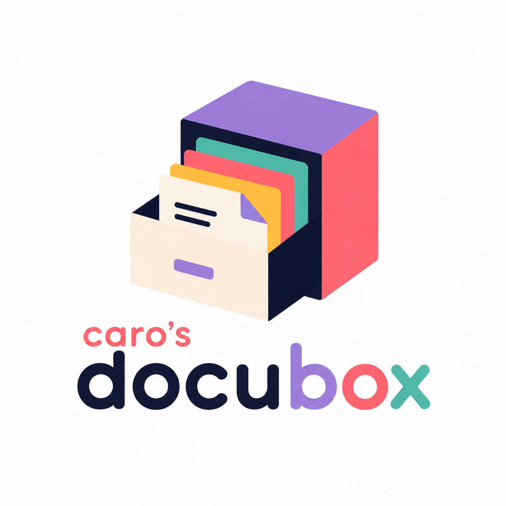

# docubox

## Guías y Tutoriales

Aquí iré recopilando recursos y guías útiles sobre diseño y desarrollo:

### [How to Build a Figma-to-Code Design Token Pipeline — Part 1](https://www.designsystemscollective.com/how-to-build-a-figma-to-code-design-token-pipeline-part-1-8b66ef9a45d4)
Guía práctica sobre cómo construir un flujo de trabajo sincronizado para transformar variables de Figma (mediante la exportación a un archivo JSON) en código funcional utilizando **Style Dictionary**, automatizando la consistencia visual y evitando que los valores de diseño y código diverjan (*design drift*).
